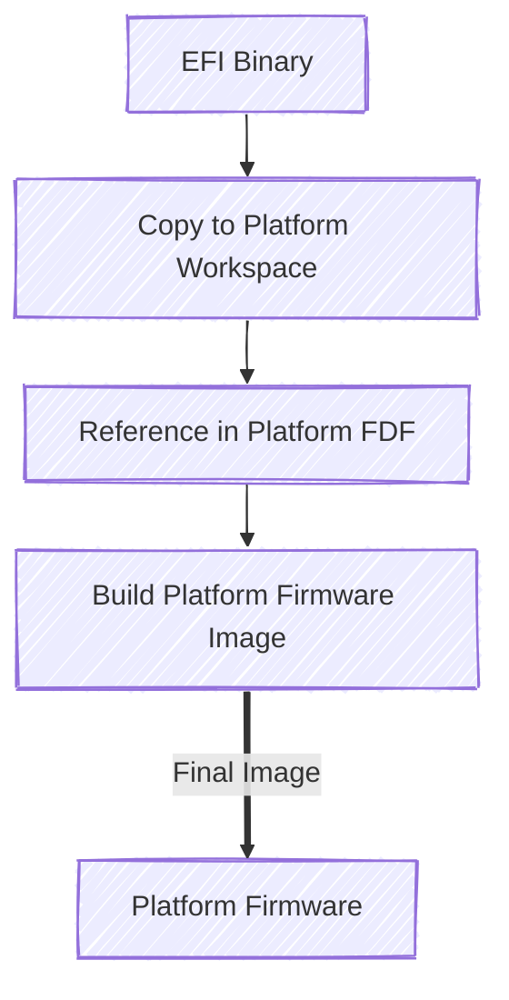

# Patina DXE Core Integration Guide

This document describes how to produce a Patina-based DXE Core binary for a UEFI platform. It covers workspace setup,
dependency selection, minimal entry scaffolding, core initialization, logging and debugging facilities,
platform‑specific service/component integration, build and feature options, and integration of the Patina DXE Core into
an existing firmware build process (typically EDK II).

It is important to understand that Patina delivers a collection of Rust crates (libraries) that are compiled into a
single monolithic DXE Core `.efi` image for a specific platform. Platform code is kept intentionally small and largely
declarative: you select implementations, supply configuration values, and register Patina components. The build to
produce the `.efi` binary uses the standard Rust toolchain (`cargo`) with UEFI targets like `x86_64-unknown-uefi` or
`aarch64-unknown-uefi`. The produced image is placed into the platform flash file (e.g. via an FDF in EDK II) replacing
the C DXE Core and select C drivers.

Patna DXE Core platform integrators do not need extensive Rust expertise to create a Patina DXE Core binary for a
platform.

---

At a high-level, the integration process consists of:

1. Selecting required Patina crates (core runtime plus optional capability modules)
2. Providing platform-specific configuration (UART base addresses, [MM
   communication](https://github.com/OpenDevicePartnership/patina/blob/main/components/patina_mm/src/component/communicator.rs)
   ports, interrupt controller bases, etc.)
3. Registering [services and components](../component/interface.md) to extend DXE Core functionality
4. Enabling optional features ([compatibility mode](#91-compatibility-mode),
   [performance tracing](#73-performance-monitoring-optional),
   [memory allocation preferences](#92-32-bit-memory-allocation-preference)) as required

Throughout this guide, terms like “Component”, “Service”, and configuration locking refer to those concepts in the
Patina component model. These terms might be used differently than they have been in past firmware projects you've
worked in. Always check the Patina definition if you are unsure of a term's definition. See the
[Component Interface](../component/interface.md) for more details about Patina components.

General steps:

1. Create Rust Binary Workspace
2. Copy Reference Implementation
3. Add patina_dxe_core Dependency
4. Setup Rust Binary Scaffolding
5. Add DXE Core Initialization
6. Setup Logger and Debugger
7. Customize Platform Services/Components
8. Build Complete DXE Core

## Guiding Principles

To better understand why the Patina DXE Core is integrated the way it is, it is helpful to understand some guiding
principles that influence its design and configuration:

1. **Safety First**: Patina prioritizes memory safety and security by leveraging Rust's ownership model and type system.
   This means configuring and customizing functionality in safe Rust code.
2. **Native First**: Patina uses Rust's native features and ecosystem to avoid unnecessary abstractions and
   compatibility layers.
3. **Upstream Tool Second**: If the native Rust ecosystem does not provide a solution, Patina uses established
   tools or libraries available in the broader Rust ecosystem. In nearly all cases, for a given problem, the preferred
   solution will be one that avoids Patina-specific or proprietary tooling.
4. **Rust Only**: In the Patina repository, only Rust code is allowed outside of server CI support. All build processes,
   tools, and other code must be written in Rust. All functions a Patina developer **needs** to perform should be
   possible through a `cargo-make` task to simplify project maintenance and lower the barrier to entry for new
   developers.
5. **Simple Configuration**: The integration process is intended to be as straightforward as possible, minimizing
   boilerplate and configuration complexity. This includes all aspects of complexity including overhead for Patina
   project maintenance, tooling, Patina component writers, and platform integrators.
6. **Minimal Configuration**: Patina values safety above flexibility. Unsafe configurations are avoided. In
   extremely rare cases where unsafe configurations are necessary, they are opt-in and require explicit
   justification. Unsafe scenarios are preferred to be unsupported rather than to provide a configuration option to
   allow unsafe functionality. This means Patina is not appropriate for platforms that require extensive unsafe
   and legacy functionality.
7. **Agility**: In order to achieve Patina's primary goals of safety and simplicity, the Patina DXE Core must be able to
   evolve rapidly. This means Patina leverages its modified version of semantic versioning to remove technical debt and
   improve safety. This also means that Patina will not support legacy platforms or architectures. Patina's goal is to
   be the safest UEFI implementation available, not the most compatible.

All of this is to say that Patina is not a good fit for every platform. To use Patina, you will likely need to make
an early and deliberate choice to prioritize safety and simplicity over legacy compatibility and extensive
legacy compatibility.

## 1. Workspace Creation

Before starting, keep in mind that these examples might not be entirely up-to-date. They are provided to better
explain the Patina DXE Core platform binary creation process in steps. Refer to the latest Patina repositories for the
most current information. The repository that demonstrates Patina DXE Core platform integration is
[OpenDevicePartnership/patina-dxe-core-qemu](https://github.com/OpenDevicePartnership/patina-dxe-core-qemu).

---

First, create a new Rust binary workspace for your platform's DXE Core. Use a descriptive name appropriate for your
platform. In this example, we use `platform_patina_dxe_core`.

```txt
> cargo new --bin platform_patina_dxe_core
> cd platform_patina_dxe_core
```

You should see the following initial structure:

```txt
├── src
|    └── main.rs
├── .gitignore
└── Cargo.toml
```

## 2. Reference Implementation

Based on your target architecture, copy the appropriate reference implementation from the
[patina-dxe-core-qemu](https://github.com/OpenDevicePartnership/patina-dxe-core-qemu) repository.

### For x86_64 Platforms

Copy the Q35 reference implementation:

```txt
> mkdir -p bin
> cp <path-to-patina-dxe-core-qemu>/bin/q35_dxe_core.rs bin/platform_patina_dxe_core.rs
```

Reference: [q35_dxe_core.rs](https://github.com/OpenDevicePartnership/patina-dxe-core-qemu/blob/main/bin/q35_dxe_core.rs)

### For AARCH64 Platforms

Copy the SBSA reference implementation:

```txt
> mkdir -p bin
> cp <path-to-patina-dxe-core-qemu>/bin/sbsa_dxe_core.rs bin/platform_patina_dxe_core.rs
```

Reference: [sbsa_dxe_core.rs](https://github.com/OpenDevicePartnership/patina-dxe-core-qemu/blob/main/bin/sbsa_dxe_core.rs)

> While the QEMU Patina DXE Core implementations provide a good starting point, you need to modify the copied file to
> suit your platform's specific requirements.

## 3. Dependencies

Inside your crate's Cargo.toml file, add the following, where `$(VERSION)` is replaced with the version of the
`patina_dxe_core` you wish to use.

### 3.1 Essential Dependency Set

Update your `Cargo.toml` to include necessary dependencies based on the reference implementation:

```toml
[dependencies]
patina_debugger = "$(VERSION)"
patina_dxe_core = "$(VERSION)"
patina_ffs_extractors = "$(VERSION)"
patina_stacktrace = "$(VERSION)"
# Add other platform-specific dependencies as needed
```

Review the `Cargo.toml` file in the `patina-dxe-core-qemu` repository for additional dependencies that may be required
for your platform.

## 4. Minimal Entry (efi_main) and `no_std`

Patina targets a firmware environment without the Rust standard library. The crate must declare `#![no_std]` and
provide a `#[panic_handler]`. The DXE Core entry function must be exported as `efi_main` with the `efiapi` calling
convention. This is an example of a minimal scaffold:

```admonish note
While Patina does not use the `std` library, it does use the Rust [`core`](https://doc.rust-lang.org/core/) library.
```

```rust,no_run
// #![no_std] // Commented out for mdbook compilation purposes
// #![no_main] // Commented out for mdbook compilation purposes
# extern crate core;
use core::{ffi::c_void, panic::PanicInfo};

#[cfg_attr(target_os="uefi", panic_handler)]
fn panic(info: &PanicInfo) -> ! {
        // Consider integrating logging and debugging before final deployment.
        loop {}
}

#[cfg_attr(target_os = "uefi", export_name = "efi_main")]
pub extern "efiapi" fn _start(physical_hob_list: *const c_void) -> ! {
        // Core initialization inserted in later steps
        loop {}
}
# fn main() {}
```

Key points:

- `#![no_std]` removes the standard library; Patina crates provide required abstractions.
- The panic handler should log and optionally emit a stack trace (see later sections).
- The entry parameter `physical_hob_list` is a pointer to the firmware’s HOB list used for memory discovery and
    early initialization (see [HOB Handling](../dxe_core/memory_management.md)).

## 5. Core Initialization Abstractions

Patina exposes trait-based extension points enabling platforms to select or provide implementations. An example for
reference is the `SectionExtractor` trait used during firmware volume section decompression or integrity handling.

If your platform only requires (for example) Brotli decompression, you can supply just that implementation. Composite
helpers are also available.

`SectionExtractor` is an abstraction point that allows a platform to specify the specific section extraction methods it
supports. As an example, a platform may only compress its sections with brotli, so it only needs to support brotli
extractions. A platform may create their own extractor; it only needs to implement the
[SectionExtractor](https://docs.rs/mu_pi/latest/mu_pi/fw_fs/trait.SectionExtractor.html) trait. However, multiple
implementations are provided via [patina_ffs_extractors](https://github.com/OpenDevicePartnership/patina/tree/main/core/patina_ffs_extractors)
such as brotli, crc32, etc.

```admonish note
If there are any new traits added, please submit a PR to update this documentation.
```

With all of that said, you can add the following code to `main.rs`, replacing the implementations in this example with
your platform-specific implementations:

```rust
# extern crate patina;
# extern crate patina_dxe_core;
# extern crate patina_ffs_extractors;
# extern crate core;
use core::ffi::c_void;
use patina_dxe_core::Core;
use patina_ffs_extractors::CompositeSectionExtractor;

#[cfg_attr(target_os = "uefi", export_name = "efi_main")]
pub extern "efiapi" fn _start(physical_hob_list: *const c_void) -> ! {
    Core::default()
        .init_memory(physical_hob_list)
        .with_service(CompositeSectionExtractor::default())
        .start()
        .unwrap();
    loop {}
}
```

```admonish note
If you copy + paste this directly, the compiler will not know what `patina_ffs_extractors` is. You will have to add
that crate to your platform's `Cargo.toml` file. Additionally, where the `Default::default()` option is, this is where
you would provide any configuration to the Patina DXE Core, similar to a PCD value.
```

## 6. Logging and Debugging

The DXE Core logging model builds on the standard [`log` crate](https://crates.io/crates/log). Patina currently
provides two logger implementations:

- [`serial_logger`](https://github.com/OpenDevicePartnership/patina/blob/main/sdk/patina/src/log/serial_logger.rs)
- [`patina_adv_logger`](https://github.com/OpenDevicePartnership/patina/tree/main/components/patina_adv_logger)

The DXE Core uses the same logger interface as [log](https://crates.io/crates/log), so if you wish to create your own
logger, follow those steps. We currently provide two loggers:

- [patina_adv_logger](https://github.com/OpenDevicePartnership/patina/tree/main/components/patina_adv_logger)
- [serial_logger](https://github.com/OpenDevicePartnership/patina/blob/main/sdk/patina_sdk/src/log/serial_logger.rs)

For this tutorial, we will use the more complex `patina_adv_logger` as it will show you how to add a `Component` to the
Patina DXE Core.

### 6.1 Logger Configuration Examples

In this example, we will talk about how to configure the loggers provided by Patina. The `SerialLogger` and
`AdvancedLogger` both have the same `new` method interface, so we will pick one for this example:

```rust
use patina_dxe_core::Core;
use patina_ffs_extractors::CompositeSectionExtractor;
use patina_adv_logger::{component::AdvancedLoggerComponent, logger::AdvancedLogger};

const LOGGER: SerialLogger<UartNull> = SerialLogger::new(
    Format::Standard, // The style to log in - standard, json, verbose json
    &[("goblin", LevelFilter::Off)], // (target, filter) tuple to filter certain log targets to certain levels
    LevelFilter::Warn, // Only log certain log levels and higher
    UartNull {}, // The SerialIO to write to. Could be a custom implementation
);
```

### 6.2 Debugger Configuration

Modify the `DEBUGGER` static to match your platform's debug serial infrastructure:

```rust
# extern crate patina;
# extern crate patina_debugger;
use patina::serial::uart::UartNull; // UartPl011 (AARCH64) and Uart16550 (X64) exist

#[cfg(feature = "enable_debugger")]
const _ENABLE_DEBUGGER: bool = true;
#[cfg(not(feature = "enable_debugger"))]
const _ENABLE_DEBUGGER: bool = false;

#[cfg(feature = "build_debugger")]
static DEBUGGER: patina_debugger::PatinaDebugger<UartNull> =
    patina_debugger::PatinaDebugger::new(UartNull {})  // <- Update for your platform
        .with_force_enable(_ENABLE_DEBUGGER)
        .with_log_policy(patina_debugger::DebuggerLoggingPolicy::FullLogging);
```

#### Adding a Logger Example

First, add the logger dependency to your Cargo.toml file in the crate:

```toml
patina = "$(VERSION)"  # includes serial_logger
```

Next, update main.rs with the following, using Uart16550 or UartPl011 for X64 / AARCH64.

```rust
# extern crate patina_dxe_core;
# extern crate patina_ffs_extractors;
# extern crate patina;
# extern crate log;
# extern crate core;
use core::ffi::c_void;

use patina_dxe_core::Core;
use patina_ffs_extractors::BrotliSectionExtractor;
use patina::log::{Format, SerialLogger};
use patina::serial::uart::UartNull; // Uart16550 or UartPl011 available for X64 / AARCH64 platforms

static LOGGER: SerialLogger<UartNull> = SerialLogger::new(
    Format::Standard, // Format to write logs in
    &[], // filters [(target, log_level)]
    log::LevelFilter::Debug, // filter level
    UartNull {} // The SerialIO writer
);

#[cfg_attr(target_os = "uefi", export_name = "efi_main")]
pub extern "efiapi" fn _start(physical_hob_list: *const c_void) -> ! {
    log::set_logger(&LOGGER).map(|()| log::set_max_level(log::LevelFilter::Info)).unwrap();

    Core::default()
        .init_memory(physical_hob_list)
        .with_service(CompositeSectionExtractor::default())
        .with_component(adv_logger_component)
        .start()
        .unwrap();
    loop {}
}
```

This does a few things. The first is it creates our actual logger (as a static), with some configuration settings.
Specifically it sets the log message format, disables logging for a few modules, sets the minimum log type allowed,
then specifies the Writer that we want to write to. In this case we are writing to port `0x402` via `Uart16550`. Your
platform may require a different writer.

Next, inside `efi_main` we instantiate the advanced logger component, which will be executed by the core at runtime.
Among other things, this component produces the Advanced Logger Protocol, so that other standard UEFI drivers may
consume and use it.

Finally, we set the global logger to our static logger with the `log` crate and then register the component instance
with the core, so that it knows to execute it.

Patina uses dependency injection in the dispatch process (see [Component Interface](../component/interface.md)) to
execute components only when their declared parameters (services, configs, HOBs, etc.) are satisfiable.

This sections shows examples of how to add components and configure a platform. This is only for illustration; your
platform may not require any of these components or configurations.

```admonish note
This is how you would add components and configuration to your platform. You can author platform components and services
as needed and attach them here in addition to the Patina provided components and services.
```

Reference implementations: [QEMU Patina DXE Core](https://github.com/OpenDevicePartnership/patina-dxe-core-qemu).

### 7.1 Management Mode (MM) (x86_64)

In this example, Patina MM configuration definitions come from the `patina_mm` crate while the QEMU Q35 platform
components come from the `q35_services` crate. The `q35_services` crate would reside in a QEMU Q35-specific platform
repository.

```rust,no_run
# extern crate patina;
# extern crate patina_dxe_core;
# extern crate patina_mm;
# let hob_list = std::ptr::null();
use patina_dxe_core::Core;

Core::default()
  .init_memory(hob_list)
  // Configure MM Communication
  .with_config(patina_mm::config::MmCommunicationConfiguration {
      acpi_base: patina_mm::config::AcpiBase::Mmio(0x0), // Set during boot
      cmd_port: patina_mm::config::MmiPort::Smi(0xB2),
      data_port: patina_mm::config::MmiPort::Smi(0xB3),
      comm_buffers: vec![],
  })
  .with_component(patina_mm::component::sw_mmi_manager::SwMmiManager::new())
  // Platform Mm Init hook
  //.with_component(q35_services::mm_control::QemuQ35PlatformMmControl::new())
  .start()
  .unwrap();
```

### 7.2 AArch64 Interrupt Controller (GIC)

For [AArch64 platforms using GIC](https://developer.arm.com/documentation/ihi0069/latest/)
(Generic Interrupt Controller):

```rust,no_run
# extern crate patina_dxe_core;
# let hob_list = std::ptr::null();
use patina_dxe_core::{GicBases, Core};

Core::default()
  .init_memory(hob_list)
  // GIC configuration for AArch64
  .with_config(GicBases::new(0x40060000, 0x40080000)); // Update for your platform
```

### 7.3 Performance Monitoring (Optional)

The
[`patina_performance`](https://github.com/OpenDevicePartnership/patina/tree/main/components/patina_performance)
component provides detailed UEFI performance measurement capabilities:

```rust,no_run
# extern crate patina;
# extern crate patina_dxe_core;
# extern crate patina_performance;
# let hob_list = std::ptr::null();
use patina_dxe_core::Core;

Core::default()
  .init_memory(hob_list)
  .with_config(patina_performance::config::PerfConfig {
      enable_component: true,
      enabled_measurements: {
          patina::performance::Measurement::DriverBindingStart
          | patina::performance::Measurement::DriverBindingStop
          | patina::performance::Measurement::LoadImage
          | patina::performance::Measurement::StartImage
      },
  })
  .with_component(patina_performance::component::performance_config_provider::PerformanceConfigurationProvider)
  .with_component(patina_performance::component::performance::Performance);
```

## 8. Complete Implementation Example

Below is a comprehensive example demonstrating integration of logging, stack tracing, and component registration.
Stack traces are produced via the
[`patina_stacktrace`](https://github.com/OpenDevicePartnership/patina/tree/main/core/patina_stacktrace)
crate when supported by the target architecture.

```rust
// #![no_std] // Commented out for mdbook compilation purposes
// #![no_main] // Commented out for mdbook compilation purposes
# extern crate core;
# extern crate patina_dxe_core;
# extern crate patina;
# extern crate patina_stacktrace;
# extern crate patina_debugger;
# extern crate patina_ffs_extractors;
# extern crate log;
# fn main() {}

use core::{ffi::c_void, panic::PanicInfo};
use patina_dxe_core::Core;
use patina_ffs_extractors::CompositeSectionExtractor;
use patina_sdk::{log::Format, serial::uart::Uart16550};
use patina_stacktrace::StackTrace;
extern crate alloc;

#[cfg_attr(target_os = "uefi", panic_handler)]
fn panic(info: &PanicInfo) -> ! {
    log::error!("{}", info);

    if let Err(err) = unsafe { StackTrace::dump() } {
        log::error!("StackTrace: {}", err);
    }

    if patina_debugger::enabled() {
        patina_debugger::breakpoint();
    }

    loop {}
}

#[cfg(feature = "enable_debugger")]
const _ENABLE_DEBUGGER: bool = true;
#[cfg(not(feature = "enable_debugger"))]
const _ENABLE_DEBUGGER: bool = false;

#[cfg(feature = "build_debugger")]
static DEBUGGER: patina_debugger::PatinaDebugger<UartNull> =
    patina_debugger::PatinaDebugger::new(UartNull {})  // <- Update for your platform
        .with_force_enable(_ENABLE_DEBUGGER)
        .with_log_policy(patina_debugger::DebuggerLoggingPolicy::FullLogging);

static LOGGER: SerialLogger<UartNull> = SerialLogger::new(
    Format::Standard, // Format to write logs in
    &[], // filters [(target, log_level)]
    log::LevelFilter::Debug, // filter level
    UartNull {} // The SerialIO writer
);

#[cfg_attr(target_os = "uefi", export_name = "efi_main")]
pub extern "efiapi" fn _start(physical_hob_list: *const c_void) -> ! {
    log::set_logger(&LOGGER).map(|()| log::set_max_level(log::LevelFilter::Info)).unwrap();

    Core::default()
        .init_memory(physical_hob_list)
        .with_service(CompositeSectionExtractor::default())
        .with_component(adv_logger_component)
        .start()
        .unwrap();

    log::info!("Dead Loop Time");
    loop {}
}
```

## 9. Feature and Memory Configuration Options

### 9.1 Compatibility Mode

The Patina DXE Core supports a compatibility mode for launching bootloaders and applications that lack
[NX (No-Execute) protection](https://en.wikipedia.org/wiki/NX_bit) support, including most shipping Linux
distributions. This feature is disabled by default to enforce modern memory protection standards.

To enable compatibility mode, add the feature flag to your platform's `Cargo.toml`:

```toml
[dependencies]
patina_dxe_core = { features = ["compatibility_mode_allowed"] }
```

**Behavior:**

- **Disabled (default)**: Only EFI applications with `NX_COMPAT` DLL characteristics will launch
- **Enabled**: Applications without NX compatibility will be permitted to execute

See [Memory Management](../dxe_core/memory_management.md) for detailed information on memory protection policies.

### 9.2 32-bit Memory Allocation Preference

By default, Patina prioritizes high memory allocation (above 4GB), which helps identify 64-bit address handling bugs
in platform components. This behavior is recommended for development and production platforms.

For platforms requiring compatibility with legacy software that improperly handles 64-bit addresses, enable 32-bit
memory preference using the `prioritize_32_bit_memory()` configuration:

```rust,no_run
# extern crate patina_dxe_core;
# let physical_hob_list = std::ptr::null();
use patina_dxe_core::Core;
Core::default()
    .prioritize_32_bit_memory()  // Add this configuration
    .init_memory(physical_hob_list);
    // ... rest of configuration
```

```admonish warning
Use default high-memory allocation for development builds to identify address width bugs during development. Only
enable 32-bit preference for production builds requiring legacy software compatibility.
```

For detailed memory allocation behavior, see [DXE Core Memory Management](../dxe_core/memory_management.md).

### 9.3 Resource Descriptor HOB Version Support

Patina DXE Core supports two mutually exclusive formats for Resource Descriptor HOBs: v1 (what EDK II uses) and v2
(v1 + cache attribute information). The version supported is selected at compile time using a Cargo feature flag:

- **Default (v2)**: Only v2 Resource Descriptor HOBs are processed. This is the default in Patina and is required for
  ARM64 platforms.
- **Compat (v1)**: If the `v1_resource_descriptor_support` feature is enabled, only V1 Resource Descriptor HOBs are
  processed in order to support an easy transition from EDK II. v2 HOBs are ignored in this mode.

Platforms are required to move to Resource Descriptor HOB v2s to accurately describe their system memory with caching
information.

In order to support easier adoption of Patina, a feature flag is provided to only process Resource Descriptor v1 HOBs.
This is simply added for bring up purposes and is not intended to be a production feature. Resource Descriptor HOB v1
support is enabled by setting the feature in the platform binary crate's `Cargo.toml`:

```toml
[dependencies]
patina = {version = "x", features = ["v1_resource_descriptor_support"]}
```

This will build and test the V1 code path by default, without needing to specify the feature flag on the command line.
For production, remove it from the default list to restore V2 as the default.

## 10. Build Process and Validation

The Patina DXE Core build process uses standard [Cargo](https://doc.rust-lang.org/cargo/) tooling with UEFI-specific
targets. Reference the
[patina-dxe-core-qemu repository](https://github.com/OpenDevicePartnership/patina-dxe-core-qemu#building)
for comprehensive build examples and configuration.

### 10.1 Required Build Configuration Files

Copy essential build infrastructure from the reference implementation:

1. **`Makefile.toml`** - [cargo-make](https://github.com/sagiegurari/cargo-make) task automation
2. **`rust-toolchain.toml`** - Ensures reproducible builds with a pinned Rust version
3. **Workspace `Cargo.toml`** - Dependency resolution and feature configuration
4. **`.cargo/config.toml`** - Custom target definitions and linker settings

### 10.2 Build Commands by Architecture

**x86_64 Targets:**

```bash
# Debug build
cargo make build

# Release build
cargo make build --release
```

**AArch64 Targets:**

```bash
# Debug build
cargo make build --target aarch64-unknown-uefi

# Release build
cargo make build --target aarch64-unknown-uefi --release
```

You can customize what [`cargo-make`](https://crates.io/crates/cargo-make) tasks are supported in your platform by
customizing the `Makefile.toml` file.

### 10.3 Build Output Validation

Successful builds produce:

- **`.efi` binary** in `target/{arch}-unknown-uefi/{profile}/`
- **Build timing report** (when using `--timings` flag)
- **Dependency resolution logs** for supply chain verification
- **`Cargo.lock`** file for reproducible builds

For detailed build optimization and binary size analysis, consult the
[Binary Size Optimization Guide](https://github.com/OpenDevicePartnership/patina-qemu/blob/main/Platforms/Docs/Common/patina_dxe_core_release_binary_size.md).

## 11. Firmware (EDK II) Integration

Once you have your EFI binary, integrate it with your EDK II platform:



### 11.1 Steps

1. **Copy the binary** to your platform workspace
2. **Update your platform FDF file** to include the binary in the firmware volume
3. **Build your platform** using the EDK II build system

### 11.2 Example FDF Entry

Add the EFI binary to your platform FDF file:

```ini
[FV.DXEFV]
  # ... other files ...
  FILE DXE_CORE = 23C9322F-2AF2-476A-BC4C-26BC88266C71 {
    SECTION PE32 = your_platform_workspace_dir/Binaries/platform_patina_dxe_core.efi
    SECTION UI = "DxeCore"
  }
```

## 12. Troubleshooting and Optimization

### 12.1 Common Issues

1. **Build failures**: Ensure all dependencies are properly specified and the rust toolchain version matches
2. **Runtime issues**: Check logger configuration and UART base address for your platform. For detailed debugging
   techniques, see the [`patina_debugging` README](https://github.com/OpenDevicePartnership/patina/tree/main/core/patina_debugger/README.md)
3. **Memory issues**: Use 32-bit memory compatibility settings if DXE code usd on the platform does not properly
   handle addresses >4GB. Review [DXE Core Memory Management](../dxe_core/memory_management.md)

### 12.2 Performance / Size Considerations

For binary size optimization and performance analysis, refer to the
[Patina DXE Core Release Binary Composition and Size Optimization](https://github.com/OpenDevicePartnership/patina-qemu/blob/main/Platforms/Docs/Common/patina_dxe_core_release_binary_size.md)
documentation.

## 13. Further Reading

After successfully integrating your Patina DXE Core binary:

- **Component Development**: Learn about creating custom Patina components in
    [Component Interface](../component/interface.md) and review sample implementations
- **Debugging Techniques**: Set up debugging workflows using tools and methods in
    [DXE Core Debugging](../dxe_core/debugging.md)

## 14. Next Steps

With your Patina DXE Core integrated:

1. **Add platform-specific components** using the Patina component system as needed
2. **Configure additional services** as needed for your platform
3. **Test thoroughly** across different boot scenarios and configurations

Your platform now has a Rust-based DXE Core foundation. Continue iterating by refining service boundaries, expanding
component coverage, and tightening security controls.

---

> Note: The Patina QEMU documentation provides an overview of where binary size comes from, and how to reduce it using the
Patina QEMU DXE Core binary as an example. You can find those details in
[Patina DXE Core Release Binary Composition and Size Optimization](https://github.com/OpenDevicePartnership/patina-qemu/blob/main/Platforms/Docs/Common/patina_dxe_core_release_binary_size.md).

### 32 bit memory compatibility

By default, the Patina core will prioritize using high memory. This has proven
beneficial in catching bugs in many different external components which did not properly
handle 64 bit addresses in all cases. It is recommended that platforms leave this default
behavior. However, for platforms that must support this buggy software the core
exposes a `prioritize_32_bit_memory()` option on it's pre-memory phase. When this
configuration is set, the core will attempt to prioritize 32 bit addressable allocations
first. For platforms that decide to use this option, it is still a good idea to leave
the default allocation scheme on debug or development builds to catch address width
bugs during development.
